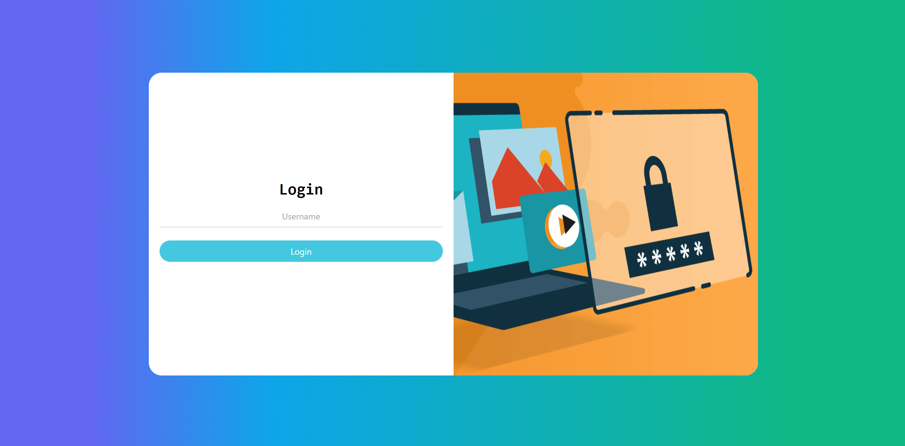
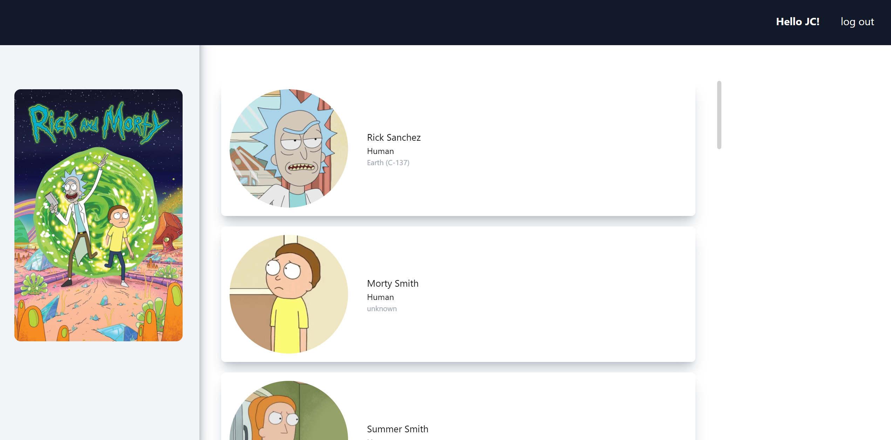
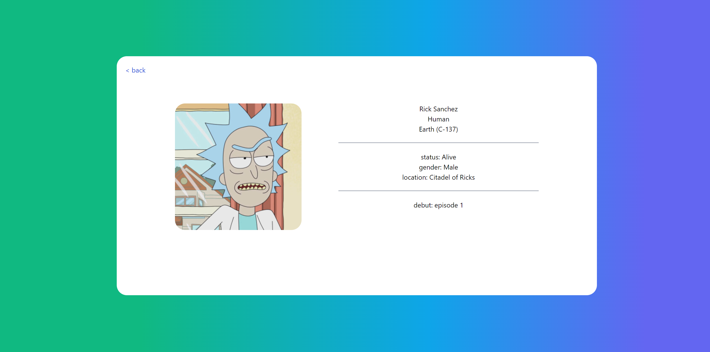

# Meztal interview project 📝  
Create a React project to display data form an API.  

## Screenshots  
  
  
  

## Desciption 
The project was made using vite with the typescript template, the reason 
behind this is that typescript allows you to develop maintainable that is
code that is easier to debug and test.

For styling I used Tailwind because it is highly customizable unlike
other frameworks and very easy to make your project resposive for mobile and several 
screen sizes. For the color scheme I tried to stay close to the colors of the
show (Rick & Morty).

To simulate authentication I saved a key-token pair to local storage
to also save the user name which is used as validation to protect the private routes
of the project.

To retrieve data I used the fetch api for simplicity since it has compatibility with
almost every browser. And for displaying the data I chose to implement an infinite 
scrolling list because I think they have a more modern look 
and is easier to understand since most of the bigger platforms like
facebook and twitter use them.

 
## Run Locally  
Clone the project  

~~~bash  
  git clone https://github.com/sjcco/meztal.git
~~~

Go to the project directory  

~~~bash  
  cd my-project
~~~

Install dependencies  

~~~bash  
npm install
~~~

Start the server  

~~~bash  
npm run dev
~~~  
 
## License  
[MIT](https://choosealicense.com/licenses/mit/)  
 